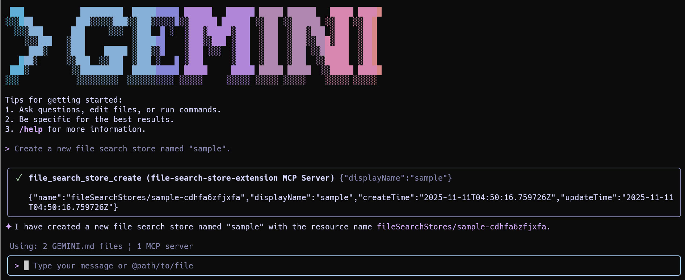
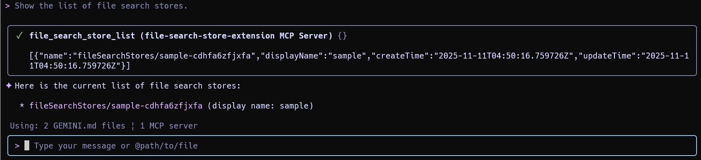
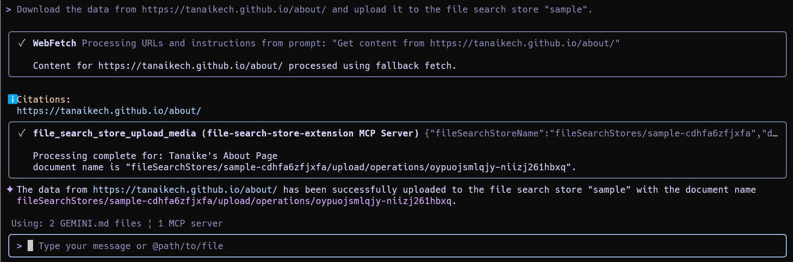
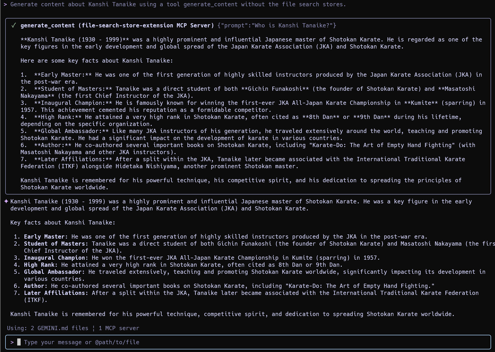
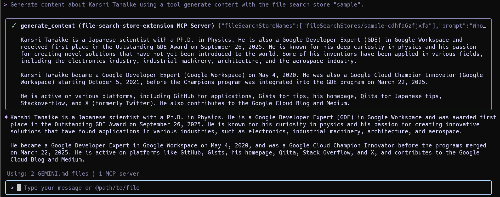
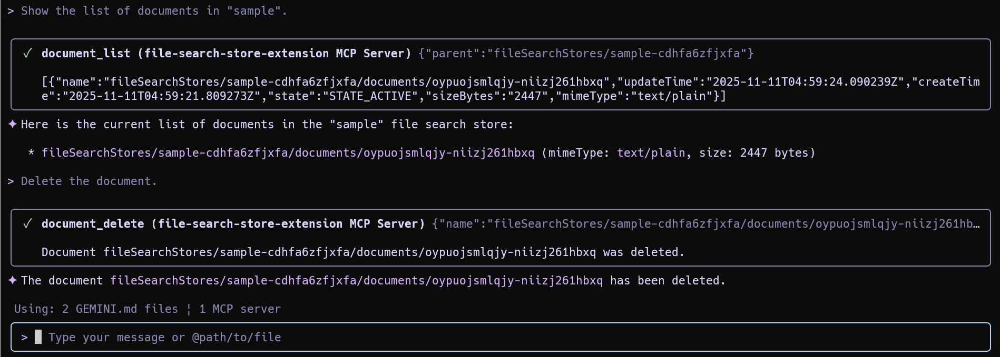
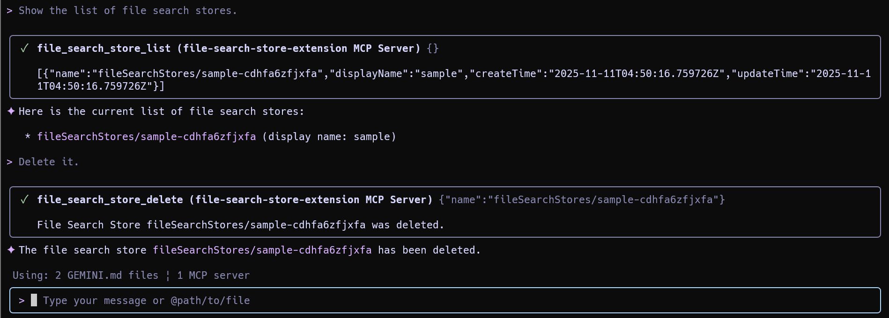

[](https://mseep.ai/app/tanaikech-filesearchstore-extension)

[](LICENCE)

<a name="top"></a>

# Integrating File Search with the Gemini CLI Extension

<a name="abstract"></a>

## Description

This repository introduces a new Gemini CLI extension that integrates File Search feature. This tool establishes a fully managed Retrieval-Augmented Generation (RAG) system directly on the command line.

The extension is designed to simplify the use of the Gemini API's File Search, a powerful new feature that enables RAG grounded in personal or proprietary knowledge bases. While the underlying API requires scripting, this Node.js-built CLI extension allows users to seamlessly manage File Search stores and generate context-aware content grounded in their private documents without having to leave the terminal interface.

## Prerequisites

Before installing the extension, ensure the following requirements are met:

- **Gemini CLI Installed:** This guide assumes you have already installed and configured the Gemini CLI.
- **Gemini API Key:** You must have a valid Gemini API key. This key needs to be accessible as an environment variable. You might have already used this for Gemini CLI.

```bash
export GEMINI_API_KEY="YOUR_API_KEY"
```

- **Model Configuration (Optional):** The extension defaults to the `gemini-1.5-flash` model. To use a different model, set the `GEMINI_MODEL` environment variable. Currently, `gemini-1.5-flash` and `gemini-1.5-pro` are supported.

```bash
export GEMINI_MODEL="gemini-1.5-pro"
```

## Installation

With the prerequisites in place, install the extension by running the following command in your terminal:

```bash
gemini extensions install https://github.com/tanaikech/FileSearchStore-extension
```

## Available Tools

Once installed, you can list the available tools provided by this extension.

**Command:**

```
> /mcp desc
```

**Output:**
This will display the 11 integrated tools on an MCP server "file-search-store-extension" for managing your File Search stores.

```
Configured MCP servers:

🟢 file-search-store-extension - Ready (11 tools)
  Tools:
  - document_delete
    Use this to delete a document.
  - document_get
    Use this to get information about a specific Document.
  - document_list
    Use this to list all Documents in a file search store.
  - file_search_store_create
    Use this to create a new file search store.
  - file_search_store_delete
    Use this to delete the file search store.
  - file_search_store_get
    Use this to get the metadata of the file search store.
  - file_search_store_import_file
    Use this to upload a file or a raw text to the file search store.
  - file_search_store_list
    Use this to get a list of file search stores.
  - file_search_store_upload_media
    Use this to upload a file or a raw text to the file search store.
  - generate_content
    Use this to generate content using the file search stores with Gemini API.
  - operation_get
    Use this to get the latest state of a long-running operation.
```

## Usage Examples

Below are typical workflows for using the extension.

### 1. Create a File Search Store

**Prompt:**

```text
Create a new file search store named "sample".
```



### 2. List File Search Stores

**Prompt:**

```text
Show the list of file search stores.
```



### 3. Upload Data to a File Search Store

You can upload data from a URL, a local file path, or a referenced file.

**Prompt (from URL):**

```text
Download the data from https://tanaikech.github.io/about/ and upload it to the file search store "sample".
```



**Prompt (from local file):**

You can also upload the local file.

```text
Upload ./sample.txt to the file search store "sample".
```

or

```text
Upload @sample.txt to the file search store "sample".
```

### 4. Generate Content (RAG)

To demonstrate the power of RAG, let's first ask a question without the File Search store. (Note: My name is Kanshi Tanaike).

**Prompt 1 (without File Search):**

```text
Generate content about Kanshi Tanaike using a tool generate_content without the file search stores.
```



As expected, the model has no specific information about me. Now, let's use the file search store we created, which contains my personal data.

**Prompt 2 (with File Search):**

```text
Generate content about Kanshi Tanaike using a tool generate_content with the file search store "sample".
```



The generated content now accurately includes my information by retrieving it from the specified store.

### 5. Delete a Document

**Prompt:**

```text
Show the list of documents in "sample".
Delete the document.
```



### 6. Delete a File Search Store

**Prompt:**

```text
Show the list of file search stores.
Delete it.
```



## Summary

This Gemini CLI extension provides a powerful and convenient way to leverage the File Search API. Here are the key takeaways:

- **Managed RAG in your Terminal:** It integrates a fully managed Retrieval-Augmented Generation (RAG) service directly into the Gemini CLI.
- **Simple Installation:** A single command is all that is needed to install the extension.
- **Comprehensive Management:** It offers 11 distinct tools to create, list, delete, and manage File Search stores and documents.
- **Flexible Data Upload:** Supports uploading data from URLs or local files.
- **Seamless Workflow:** Enables a complete workflow from data ingestion to grounded content generation without leaving the command line.

---

<a name="licence"></a>

# License

[MIT](LICENCE)

<a name="author"></a>

# Author

[Tanaike](https://tanaikech.github.io/about/)

[Donate](https://tanaikech.github.io/donate/)

<a name="updatehistory"></a>

# Update History

- v1.0.0 (November 11, 2025)

  1.  Initial release.

- v1.0.1 (November 13, 2025)

  1.  A bug was removed.

[TOP](#top)
